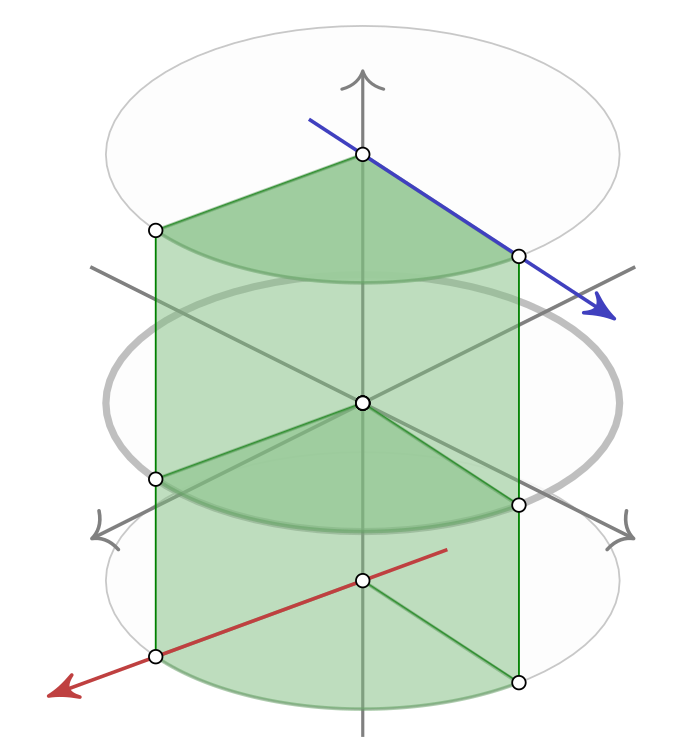

# LiLiKin - Library for Line Kinematics

Basic idea is to create a CCC mechanism, which is a fully actuated mechanism in a 6D Task Space.

This library provides the basic structures to describe the problem and the FK/IK - algebraically!
Basically, Pluecker lines, Dual Algebra and advanced operations on the Pluecker lines are used.

## CCC Mechanism

A CCC mechanism consists of three cylindrical (C) joints.
A cylindrical joint has two degree of freedoms
  as it can translate and rotate around the cylinder main axis,
  which is considered as the joint axis.
The joint axis can be mathematically described as a line, hence Line Kinematics,
  where points are actuated on the surface of a cylinder around the line.
Lines can also be transformed by other lines.

Image from "An analysis of the dual-complex unit circle with applications to line geometry" by Bongardt.

### Construction

The concept of Line Kinematics is based on the product of exponentials:

x = exp(phi_1 * line_1) * exp(phi_2 * line_2) * exp(phi_3 * line_3) * zero_posture

Thus, to calculate an FK ({phi_1, phi_2, phi_3} -> x) or an IK (x -> {phi_1, phi_2, phi_3})
  the parameters of the mechanism have to be specified.
These are the lines (line_1, line_2, line_3) and the zero_posture,
  which is some kind of an offset to describe ({0,0,0} -> zero_posture).

This means, a mechanism can only be described by its joint axis' and its zero_posture, 
  which will be needed in the constructor for the mechanism.
  
## Line Geometry

There are different ways to describe a line and a frame. 
In this library, a mixture of vectors and matrices including some sort of dual algebra is used.

### Dual Matrices

Historically motivated, the matrices, 
  which could be described as dual 3x3 matrices,
  are embedded as 6x6 real matrices.
The embedding follows the dual number matrix representation but blown up to 6x6 for embedding the 3x3 matrices.

### Lines

The lines and screws are described as 6 vectors, 
  where the upper three form the direction and the lower three elements form the moment.
Again, this is historically grown.
The lines could also be described as a dual 3 vector with the dual part being the moment of the line.

## Operations

The heart of the library are the operations, which are given by the Pluecker lines.
Ironically, some operations are not well documented in the community.
Thus, some of them are formulated while implementing this library.

### Dual Trigonometric Equation

There are some problems, e.g the Rodriguez-Formula, which can be described with the equation:

a cos(phi) + b sin(phi) = c

a, b and c are given parameters and the task would be to find phi.
This yields to an equivalent quadratic equation with at most two solutions, 
  which can be retrieved algebraically via half-tangens substitutions
  or geometrically.
  
See DualNumberAlgebra::solve_trigonometric_equation()

### Acos3

The acos3 for lines describes the dual angle between two lines
  with respect to a third reference line.
It is used to find phi in:

line_b = exp(phi * line_ref) * line_a

See Screw::acos3()

### Rodriguez Formula

Another important operation is the Generalized Rodriguez-Formula for lines to actually compute:

exp(phi * line)

See DualFrame::DualFrame(const DualSkewProduct &argument)
